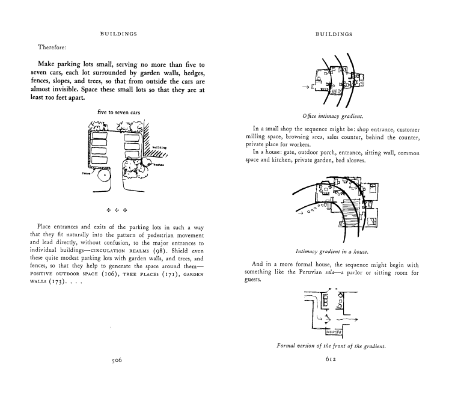

## PATTERN & ANTI-PATTERN

---

- Model, example.
- A design, motif or decoration, especially formed from regular repeated elements.
- A particular sequence of events, facts etc. which can be understood, used to predict the future, or seen to have a mathematical, geometric, statistical etc. relationship.

---

## DESIGN PATTERN

---

Christopher Alexander − _architecte anthropologue_

---

« La manière de construire la plus efficace a des centaines d'années. Si vous prenez les monuments traditionnels dans lesquels l'homme se sent chez lui ; les villages, les tentes et les temples ont toujours été érigés par des gens proches de ces constructions et de ce qui a permis de les construire. Il est impossible de faire de grands monuments ou d'endroits confortables sans suivre cette méthode qui s'inspire de formes naturelles ancestrales tel que les arbres, les collines ou les visages. »

---

« A Pattern Language: Towns, Buildings, Construction » − Christopher Alexander, Sara Ishikawa et Murray Silverstein, 1977

---

Un langage de schéma, constitué de 253 _modèles (patterns)_, chaque modèle décrit:

- un problème
- une illustration
- et une proposition de solution

---

---

« Design Patterns – Elements of Reusable Object-Oriented Software » − Erich Gamma, Richard Helm, Ralph Johnson et John Vlissides, 1995

---

Description de 23 design patterns suivant un formalisme emprunté à celui de l'essai de Cristopher Alexander et consorts :

- Nom
- Description du problème à résoudre
- Description de la solution
- Conséquences

---

## Exemples

---

- Decorator

Ce patron permet d'attacher dynamiquement des responsabilités à un objet. Une alternative à l'héritage. Ce patron est inspiré des poupées russes.

---

- Proxy

Ce patron est un substitut d'un objet, qui permet de contrôler l'utilisation de ce dernier.

---

## ANTI-PATTERN

---

Considérons qu'un _pattern_ est un _anti-pattern_ si :

- bien que semblant proposer une solution appropriée et efficace, elle produit plus de mauvaise conséquence que de bonne
- une autre solution existe, est documentée, réproductible et prouvée efficace.

---

- Input kludge: Failing to specify and implement the handling of possibly invalid input

---

- God object: Concentrating too many functions in a single part of the design (class)

---

- Yo-yo problem: A structure (e.g., of inheritance) that is hard to understand due to excessive fragmentation

---

- Action at a distance: Unexpected interaction between widely separated parts of a system

---

- Boat anchor: Retaining a part of a system that no longer has any use

---

- Cargo cult programming: Using patterns and methods without understanding why

---

- Caching failure: Forgetting to clear a cache that holds a negative result (error) after the error condition has been corrected

---

- Error hiding:

Catching an error message before it can be shown to the user and either showing nothing or showing a meaningless message.
Also can refer to erasing the Stack trace during exception handling, which can hamper debugging.

---

- Lava flow: Retaining undesirable (redundant or low-quality) code because removing it is too expensive or has unpredictable consequences

---

- Loop-switch sequence: Encoding a set of sequential steps using a switch within a loop statement
